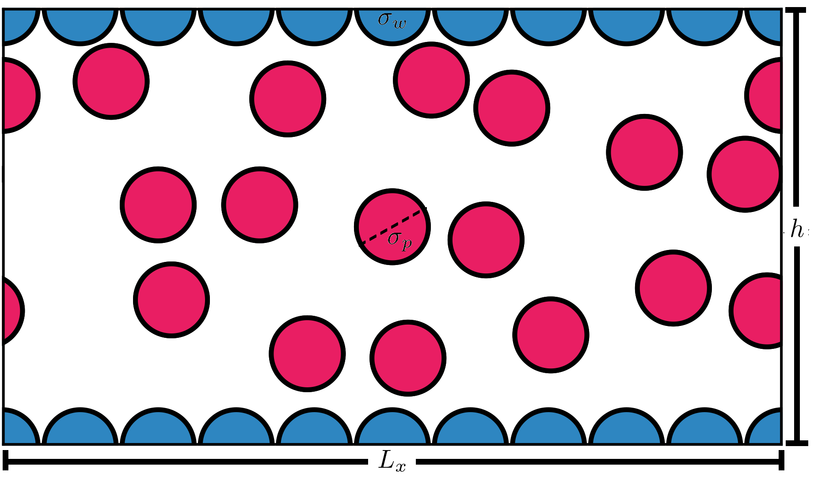
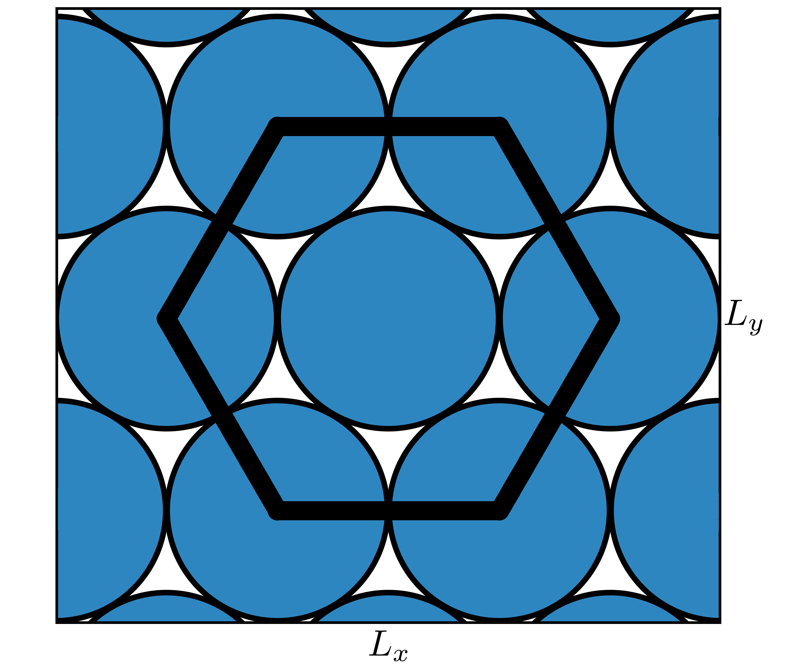
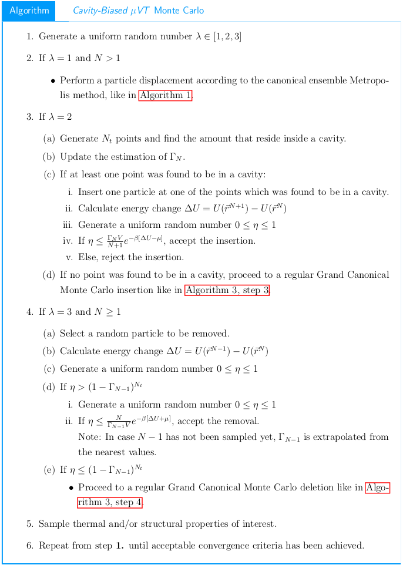

# Cavity-Biased Markov-Chain Monte Carlo for the adsorption of confined fluids

Semi-interactive code for the simulation of confined fluids, under graphene-slit-like walls, in the μVT ensemble according to Mezei's Cavity-Biased algorithm for the efficient insertion of high-density systems.

Code is designed for the calculation of the thermal (i.e. energy per particle, adsorption, density distribution, etc) and structural properties for mixtures of monoatomic molecules confined by hexagonally arranged molecules constituting a slit-like wall, each of these having a square-well potential of interaction.

Generation of states goes according to the Cavity-Biased method with equal chances for the insertion, removal and displacement of molecules as encapsulated in this scheme:

Simulation parameters are minutiously selected for optimal convergence, according to results published in various scientific researches. This includes a 20σ ✕ 20σ ✕ hσ simulation box with 2 ✕ ⌈ 0.5 ✕ V ⌉ ✕ 10E4 relaxation steps and 2.5 ✕ ⌈ 0.5 ✕ V ⌉ ✕ 10E5 equilibrium steps, for a total of 25,000 samples.

Execution is straightforward by parsing arguments:

    julia Confined.jl -h
    usage: Confined_GrandCanonical.jl [-D Ρ_BULK] [-C CONFIGURATIONS] [-P POVRAY] [-h] μ T h

    positional arguments:
    μ                     Chemical Potental (type: Float64)
    T                     Temperature (type: Float64)
    h                     Slit's Separation (type: Float64)

    optional arguments:
    -D, --ρ_Bulk          Bulk fluid's density (type: Float64, default: 1.0)
    -C, --Configurations  Enable/Disable Saving Configuraitons (type: Bool, default: false)
    -P, --PovRay          Enable/Disable PovRay Animations (type: Bool, default: false)
    -h, --help            show this help message and exit

Three of these are mandatory: 

* Chemical potential
* Temperature
* Slit's Separation

Another three parameters are optional:

* ρ_Bulk: Used for the normalization of the distribution profiles, in case a bulk simulation was previously carried out.
* PovRay: Generates x- and z-axis images of the adsorption in the pore via RayTracing techniques (PovRay must be installed, execution is automatic).
* Configurations: Saves the sampled configurations (default: 25,000) in *.xyz for deeper analysis. BEWARE: High-density systems require large amounts of storage.